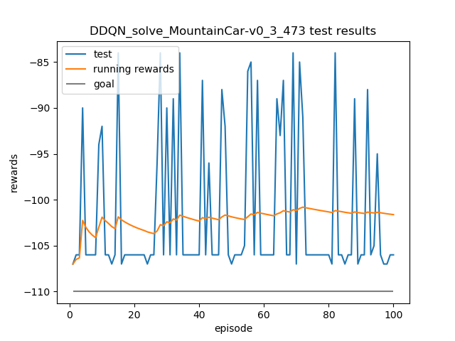

# reinforcement-learning-algorithm

implementation of reinforcement learning algorithm that is easy to read and understand

# algorithm implemented and corresponding paper

- DQN
  [Playing Atari with Deep Reinforcement Learning](https://arxiv.org/abs/1312.5602),
  [Human-level control through deep reinforcement learning](https://www.nature.com/articles/nature14236?wm=book_wap_0005)
- DDQN
  [Deep Reinforcement Learning with Double Q-learning](https://arxiv.org/abs/1509.06461)
- Dueling DQN
  [Dueling Network Architectures for Deep Reinforcement Learning](https://arxiv.org/abs/1511.06581)
- DDQN with prioritized experience replay
  [Prioritized Experience Replay](https://arxiv.org/abs/1511.05952)
- REINFORCE(Monte-Carlo Policy Gradient)
- DDPG
  [Continuous control with deep reinforcement learning](https://arxiv.org/abs/1509.02971)
- TD3
  [Addressing Function Approximation Error in Actor-Critic Methods](https://arxiv.org/abs/1802.09477)

# online result

> training result of the agent trying to solve a problem from a scratch

### CartPole-v1

### MountainCar-v0

### LunarLander-v2

### Acrobot-v1

### Pendulum-v0

### HalfCheetah-v3

# offline result

> online training is not always stable 
> sometimes the agent gets a high reward(or running reward) 
> then its performance would decline rapidly. 
> so I choose some policy during the training to test the agent's performance

### CartPole-v1

### MountainCar-v0

### LunarLander-v2

### Acrobot-v1

### Pendulum-v0

[comment]: <> (![Pendulum-v0]&#40;results/Acrobot-v1-offline.png&#41;)

### HalfCheetah-v3

